## Endpoints:

* 1. Login
* 2. Logout
* 3. Signup
* 4. Get current user
* 5. Delete user
* 6. Get all posts
* 7. Create post
* 8. Get specific post
* 9. Update post
* 10. Delete post
* 11. Get all favorites
* 12. Create favorite
* 13. Delete favorite
* 14. Get all reviews
* 15. Create review
* 16. Get specific review
* 17. Delete review
* 18. Create status
* 19. Update status
* 20. Delete status
* 21. Get all statuses

## Login:

Endpoint path: /token
Endpoint method: POST

Request body:

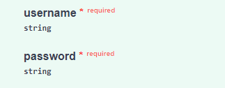

Response example:

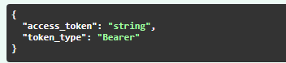

## Logout:

Endpoint path: /token

Endpoint method: DELETE

Reponse example:

## Signup:

Endpoint path: /api/users

Endpoint method: POST

Request body:

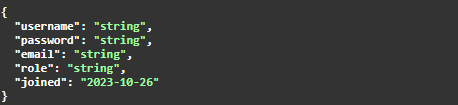

Reponse example:

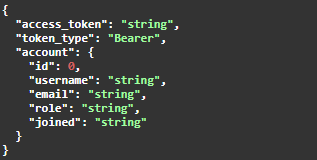

## Get current user:

Endpoint path: /api/user

Endpoint method: GET

Reponse example:

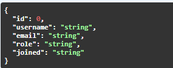

## Delete user:

Endpoint path: api/users/{username}

Endpoint method: DELETE

Request body:

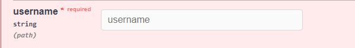

Reponse example:

## Get all posts:

Endpoint path: api/posts

Endpoint method: GET

Reponse example:

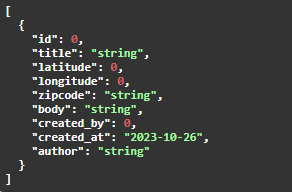

## Create post:

Endpoint path: /api/posts

Endpoint method: POST

Request body:

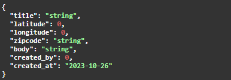

Reponse example:

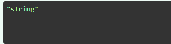

## Get specific post:

Endpoint path: /api/posts/{post_id}

Endpoint method: GET

Request body:

Reponse example:

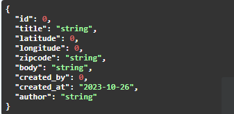

## Update post:

Endpoint path: /api/posts/{post_id}

Endpoint method: PUT

Request body:

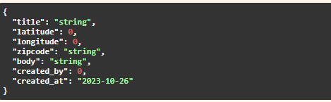

Reponse example:

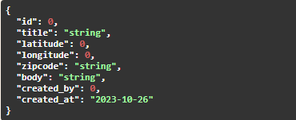

## Delete post:

Endpoint path: /api/posts/{post_id}

Endpoint method: DELETE

Request body:

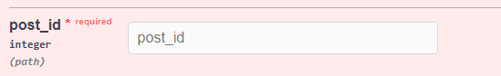

Reponse example:

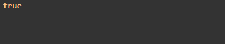

## Get all favorites:

Endpoint path: /api/favorites

Endpoint method: GET

Reponse example:

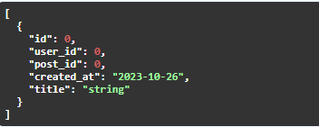

## Create favorite:

Endpoint path: /api/favorites

Endpoint method: POST

Request body:

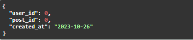

Reponse example:

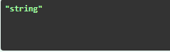

## Delete favorite:

Endpoint path: /api/favorites/{favorites_id}

Endpoint method: DELETE

Request body:

Reponse example:

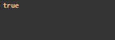

## Get all reviews:

Endpoint path: /api/review

Endpoint method: GET

Reponse example:

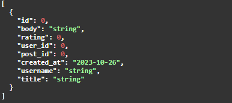

## Create review:

Endpoint path: /api/review

Endpoint method: POST

Request body:

Reponse example:

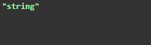

## Get specific review:

Endpoint path: /api/review/{post_id}

Endpoint method: GET

Request body:

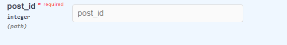

Reponse example:

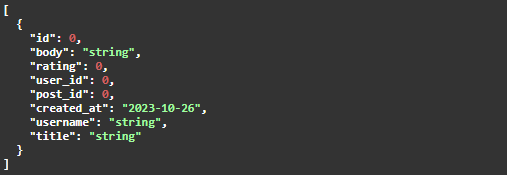

## Delete review:

Endpoint path: api/review/{review_id}

Endpoint method: DELETE

Request body:

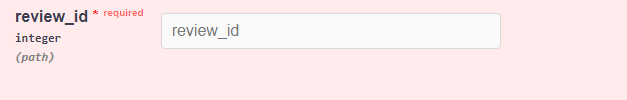

Reponse example:

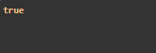

## Create status:

Endpoint path: /api/status

Endpoint method: POST

Request body:

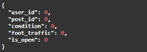

Reponse example:

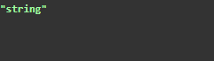

## Update status:

Endpoint path: /api/status/{status_id}

Endpoint method: PUT

Request body:

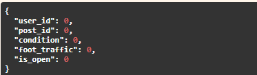

Reponse example:

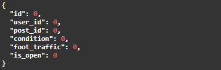

## Delete status:

Endpoint path: /api/status/{status_id}

Endpoint method: DELETE

Request body:

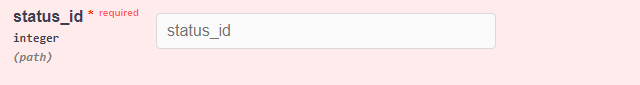

Reponse example:

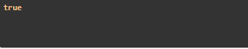

## Get all statuses:

Endpoint path: api/status/{post_id}

Endpoint method: GET

Request body:

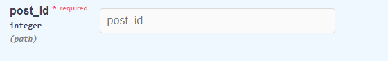

Reponse example:

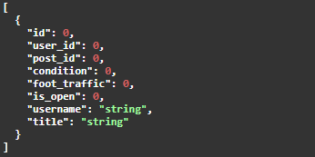
